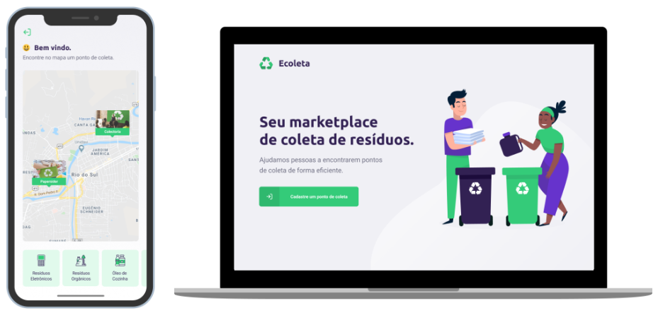

# Next_Level_Week

Este projeto tem como objetivo auxiliar usuários a encontrarem pontos de coleta de resíduos de forma eficiente.

Conhecimentos aplicados:

- NodeJs;
- ReactJs;
- React Native;
- SQLite3;
- Expo.
